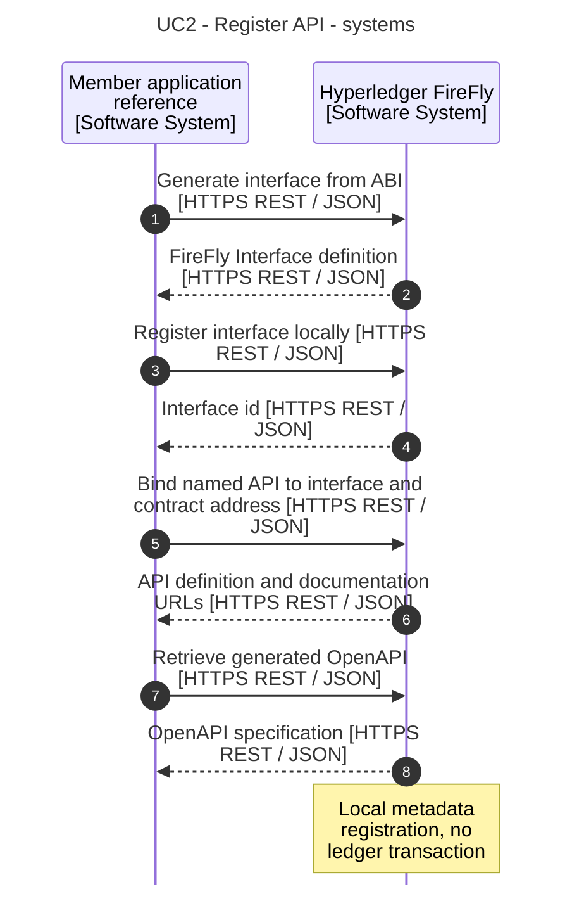
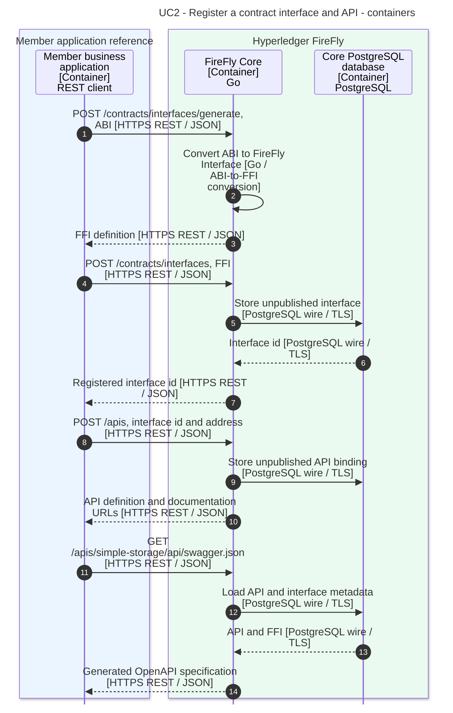

# 2. Register a contract interface and API

[Use-case index and shared notation](README.md)

Make an already deployed contract available through a named FireFly HTTP API, using the ABI to describe its methods and events.

**Prerequisites:** The member knows the deployed `SimpleStorage` address and ABI. API access is authorized in the selected namespace.

**Outcome:** The local `simple-storage` API exposes `invoke/set`, `query/get`, and generated OpenAPI documentation. Registration does not redeploy the contract.

## API and example

1. `POST /contracts/interfaces/generate` with `name`, `version`, and `input.abi` converts the ABI to a FireFly Interface (FFI).
2. `POST /contracts/interfaces` registers that FFI; retain its `id`.
3. `POST /apis` with `name: "simple-storage"`, `interface.id`, and `location.address` creates the named API.
4. `GET /apis/simple-storage/api/swagger.json` returns its generated OpenAPI specification.

Omit `publish=true` in these examples so the interface and API remain local. The endpoints for API registration are `/apis`, not `/contracts/apis`.

All API paths in this document use the namespace prefix `/api/v1/namespaces/{ns}` unless stated otherwise. The diagrams abbreviate that prefix. Names and addresses are example values.

## Software-system sequence

## Container sequence

## Behavior and failure cases

- A malformed ABI, invalid FFI, unknown interface, or conflicting registration fails before a usable API is created. Registration alone does not prove that an ABI matches the bytecode at the supplied address.
- Publishing is optional: add `?publish=true` when creating the interface/API, or subsequently use `POST /contracts/interfaces/{name}/{version}/publish` and `POST /apis/{apiName}/publish`. In multiparty mode, publication broadcasts metadata and pins it on-chain; that additional flow is outside these local-registration diagrams.
- An omitted `location` makes the caller supply the location on each query/invoke. This collection binds it once for clarity.
- ABI conversion runs in Core's embedded Ethereum plugin; it is not a separate container or a call to Besu.

## Official sources

- [Ethereum smart-contract tutorial](https://github.com/hyperledger-firefly/firefly/blob/9d20f3081c9074d5b012427e5572ebc03da8d95d/doc-site/docs/tutorials/custom_contracts/ethereum.md).
- [Official API specification](https://github.com/hyperledger-firefly/firefly/blob/9d20f3081c9074d5b012427e5572ebc03da8d95d/doc-site/docs/swagger/swagger.yaml).
- [ABI conversion implementation](https://github.com/hyperledger-firefly/firefly/blob/9d20f3081c9074d5b012427e5572ebc03da8d95d/internal/blockchain/ethereum/ethereum.go).

The [evidence baseline and model mapping](README.md#evidence-baseline) distinguish documented behavior from this workspace's configuration choices.
