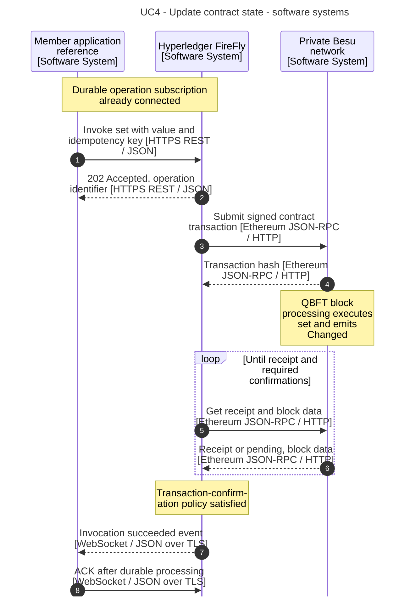
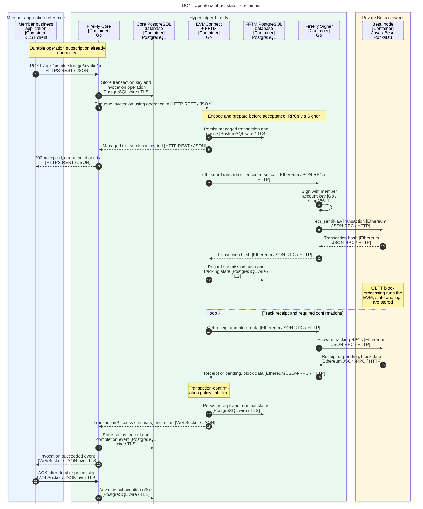

# 4. Update contract state

[Use-case index and shared notation](README.md)

Set the `SimpleStorage` value and track the operation until the blockchain reports its execution result.

**Prerequisites:** The named API exists, the member's account can submit transactions, and its signing key is managed through the configured connector/Signer path. Establish the [durable operation subscription](README.md#asynchronous-application-pattern) before submitting.

**Outcome:** The successful operation identifies a transaction whose execution changed the stored value and emitted `Changed`. Application delivery of that event is covered separately in use case 5.

## API and example

`POST /apis/simple-storage/invoke/set` accepts, for example:

```json
{
  "idempotencyKey": "set-value-0001",
  "input": { "newValue": 3 }
}
```

Save the returned operation `id` and transaction reference `tx`. Receive `blockchain_invoke_op_succeeded` or `blockchain_invoke_op_failed`, match `event.reference` to the operation `id`, persist processing, then ACK. The diagrams show success.

Use `GET /operations/{opid}?fetchstatus=true` for missing details or a stalled operation. Connector receipt details appear under `detail.receipt`; Core's `output` is a result summary. `GET /transactions/{txnid}/operations` lists operations belonging to a FireFly transaction. See the [shared delivery guarantees](README.md#delivery-guarantees-and-result-data).

All API paths in this document use the namespace prefix `/api/v1/namespaces/{ns}` unless stated otherwise. The diagrams abbreviate that prefix. Names and addresses are example values.

## Software-system sequence



## Container sequence



## Behavior and failure cases

- Acceptance, block inclusion, connector confirmation and application processing are separate milestones. Core returns after connector acceptance, while blockchain submission and completion proceed asynchronously.
- Core owns its operation records; embedded FFTM owns connector transaction/nonce state in a separate database. No standalone FFTM runtime is introduced.
- Transaction preparation can reject a call before submission. A mined transaction may still revert; inspect receipt/operation status rather than treating block inclusion as success. See [use case 7](07-failures-and-recovery.md).
- The connector applies its configured receipt/confirmation policy. Contract-log delivery follows the event-stream confirmation policy in [use case 5](05-subscribe-contract-events.md); this collection does not invent a confirmation count.
- Only public method arguments belong in this call. Besu permissioning does not conceal calldata or ledger state from consortium nodes.
- The transaction-result notification is best effort. A missed notification can leave Core pending; durable application replay alone cannot resolve it. Use [targeted reconciliation](07-failures-and-recovery.md#reconcile-a-missing-completion) without creating a new business action.

## Official sources

- [Ethereum smart-contract tutorial](https://github.com/hyperledger-firefly/firefly/blob/9d20f3081c9074d5b012427e5572ebc03da8d95d/doc-site/docs/tutorials/custom_contracts/ethereum.md).
- [Blockchain Connector Toolkit](https://github.com/hyperledger-firefly/firefly/blob/9d20f3081c9074d5b012427e5572ebc03da8d95d/doc-site/docs/architecture/blockchain_connector_framework.md).
- [Official API specification](https://github.com/hyperledger-firefly/firefly/blob/9d20f3081c9074d5b012427e5572ebc03da8d95d/doc-site/docs/swagger/swagger.yaml).
- [Besu QBFT consensus](https://docs.besu-eth.org/private-networks/how-to/configure/consensus/qbft).
- [Operation events](https://github.com/hyperledger-firefly/firefly/blob/9d20f3081c9074d5b012427e5572ebc03da8d95d/doc-site/docs/reference/types/_includes/event_description.md).
- [FFTM confirmation and terminal status](https://github.com/hyperledger-firefly/transaction-manager/blob/5915cbc4e0e30dea25068b770dadbcc8bdfa9321/pkg/txhandler/simple/policyloop.go#L335-L357).
- [Result summaries and best-effort delivery](https://github.com/hyperledger-firefly/transaction-manager/blob/5915cbc4e0e30dea25068b770dadbcc8bdfa9321/pkg/fftm/transaction_events_handler.go#L94-L120).

The [evidence baseline and model mapping](README.md#evidence-baseline) distinguish documented behavior from this workspace's configuration choices.
