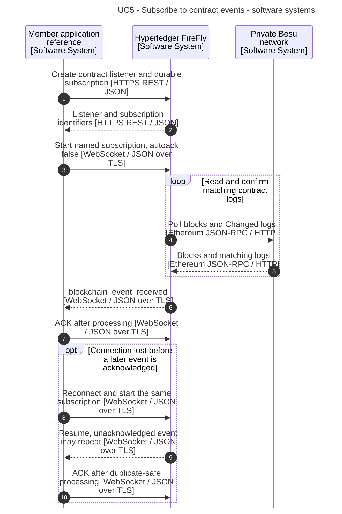
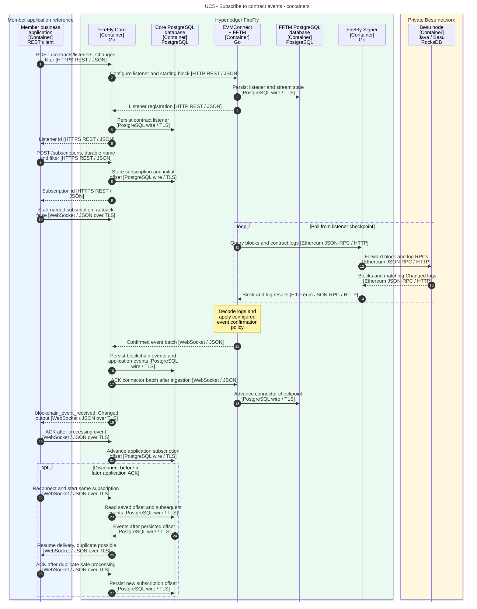

# 5. Subscribe to contract events

[Use-case index and shared notation](README.md)

Receive `SimpleStorage.Changed` events reliably through a durable FireFly subscription and recover delivery after a disconnection.

**Prerequisites:** The contract ABI includes `Changed`; the named API is registered; an application consumer can retain processed event identifiers and acknowledge only after handling an event.

**Outcome:** The application receives `blockchain_event_received`, processes its decoded `Changed` output, and advances its subscription offset through an explicit acknowledgement.

## API and example

Create a listener using `POST /contracts/listeners`, identifying the interface, contract address, and `Changed` event. Set listener `options.firstEvent` to `"oldest"` to include past logs for this tutorial.

Create a durable subscription using `POST /subscriptions` with `name: "simple-storage-events"`, `transport: "websockets"`, `filter.events: "blockchain_event_received"`, `filter.blockchainevent.listener` set to the listener ID, and `options.firstEvent: "oldest"`.

Connect to the server-level `/ws` endpoint over WSS in this workspace example and send:

```json
{"type":"start","namespace":"default","name":"simple-storage-events","autoack":false}
```

After durable processing, send `{"type":"ack","id":"<event-id>","subscription":{"namespace":"default","name":"simple-storage-events"}}`. The subscription reference is required when multiple subscriptions share a WebSocket. The listener's starting block and the application's subscription offset are separate cursors.

All API paths in this document use the namespace prefix `/api/v1/namespaces/{ns}` unless stated otherwise. The diagrams abbreviate that prefix. Names and addresses are example values.

## Software-system sequence



## Container sequence



## Behavior and failure cases

- This subscription delivers contract logs. Use the [operation-result subscription](README.md#asynchronous-application-pattern) for invocation/deployment completion; no ordering is guaranteed between subscriptions.
- Connector ingestion and application consumption have separate acknowledgements and durable positions. An application ACK does not confirm a blockchain transaction.
- Contract-log batch replay differs from the best-effort transaction-result notifications described in the [shared guarantees](README.md#delivery-guarantees-and-result-data).
- Delivery is at least once. A crash after processing but before the ACK is persisted can replay an event; consumers should deduplicate using stable event identifiers and make business effects idempotent.
- Restart with the same durable subscription name and namespace. An ephemeral subscription or automatic acknowledgement is not a substitute for this recovery pattern.
- Creating the listener after a transaction does not lose its logs if its starting position includes the transaction and the node can supply the required history. Use a deliberate start position in a real deployment rather than assuming every application needs all history.
- A stalled ledger or inaccessible RPC endpoint delays new events. Webhooks are an alternative transport, not an additional step in this WebSocket sequence.

## Official sources

- [Ethereum smart-contract tutorial](https://github.com/hyperledger-firefly/firefly/blob/9d20f3081c9074d5b012427e5572ebc03da8d95d/doc-site/docs/tutorials/custom_contracts/ethereum.md).
- [Event bus](https://github.com/hyperledger-firefly/firefly/blob/9d20f3081c9074d5b012427e5572ebc03da8d95d/doc-site/docs/reference/events.md).
- [Subscription delivery and acknowledgements](https://github.com/hyperledger-firefly/firefly/blob/9d20f3081c9074d5b012427e5572ebc03da8d95d/doc-site/docs/reference/types/_includes/subscription_description.md).
- [Blockchain Connector Toolkit](https://github.com/hyperledger-firefly/firefly/blob/9d20f3081c9074d5b012427e5572ebc03da8d95d/doc-site/docs/architecture/blockchain_connector_framework.md).
- [Official API specification](https://github.com/hyperledger-firefly/firefly/blob/9d20f3081c9074d5b012427e5572ebc03da8d95d/doc-site/docs/swagger/swagger.yaml).

The [evidence baseline and model mapping](README.md#evidence-baseline) distinguish documented behavior from this workspace's configuration choices.
