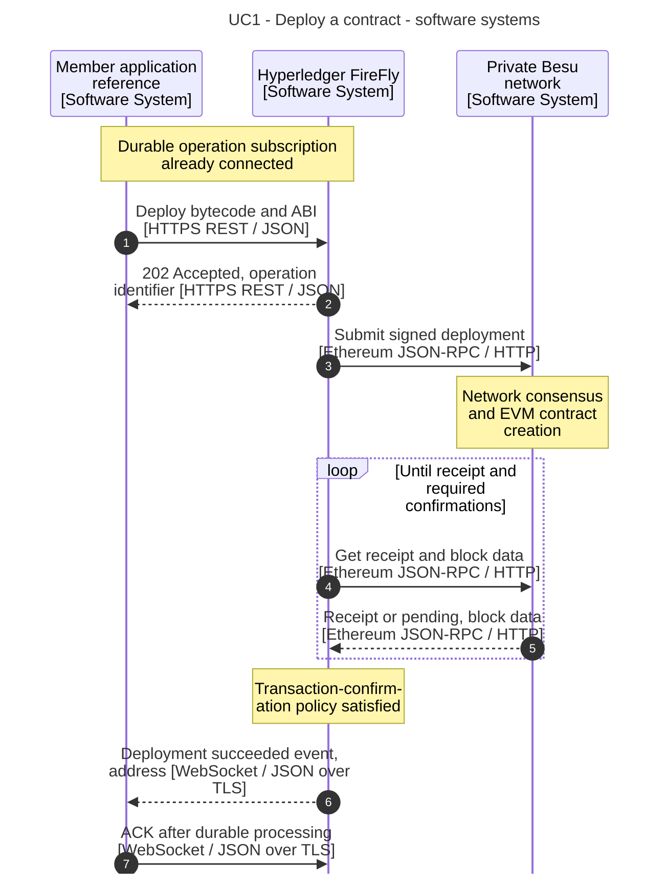
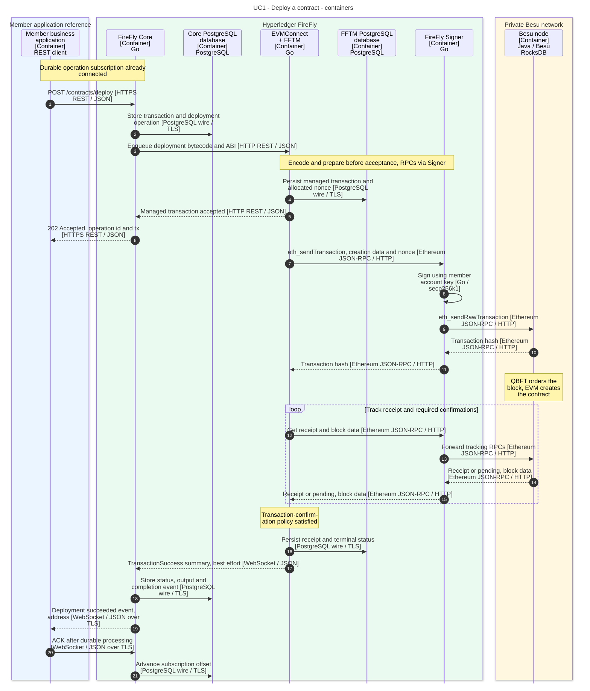

# 1. Deploy a contract

[Use-case index and shared notation](README.md)

Deploy the compiled `SimpleStorage` contract using a member's FireFly signing identity, then obtain the deployed address.

**Prerequisites:** A running namespace uses EVMConnect and FireFly Signer; the signing account is permitted and has sufficient funds if gas is charged. Establish the [durable operation subscription](README.md#asynchronous-application-pattern) before submitting. Compile the official tutorial's Solidity example beforehand; FireFly receives bytecode and ABI, not Solidity source.

**Outcome:** A successful deployment operation exposes the address as `output.contractLocation.address`. Save that address for API registration.

## API and example

`POST /contracts/deploy` accepts `contract` (compiled bytecode), `definition` (ABI), `input` (constructor arguments), and optional `key` and `idempotencyKey`. `SimpleStorage` has no constructor arguments. Retain the returned operation `id` and `tx`; `tx` references the FireFly transaction, not the Ethereum transaction hash.

Receive `blockchain_contract_deploy_op_succeeded` or `blockchain_contract_deploy_op_failed` through the durable subscription. Correlate `event.reference` with the operation `id`, persist the result, then ACK. The diagrams show success; the [recovery use case](07-failures-and-recovery.md) covers missing results and failures.

The diagrams use the default asynchronous request. `?confirm=true` is an optional waiting mode; a request timeout still requires status reconciliation.

All API paths in this document use the namespace prefix `/api/v1/namespaces/{ns}` unless stated otherwise. The diagrams abbreviate that prefix. Names and addresses are example values.

## Software-system sequence

## Container sequence

## Behavior and failure cases

- Acceptance, block inclusion, connector confirmation and application processing are separate milestones. Core returns after the connector accepts the managed transaction; blockchain submission and completion proceed asynchronously.
- Invalid ABI/bytecode or constructor parameters can fail validation or transaction preparation. Account rejection, inadequate gas, or a reverted constructor prevents successful deployment.
- A pending receipt is not failure. Track the original operation after a timeout; use the same idempotency key when reconciling submission as described in [use case 7](07-failures-and-recovery.md).
- Contract compilation, key provisioning, nonce/gas preparation RPCs, and consensus internals are prerequisites or summarized steps. Application signing keys are separate from Besu validator keys.
- The transaction-result notification is best effort. A missed notification can leave Core pending; durable application replay alone cannot resolve it. Use [targeted reconciliation](07-failures-and-recovery.md#reconcile-a-missing-completion) without creating a new business action.
- Normal completion supplies `output.contractLocation.address`. If the connector notification was lost, recovery can obtain the address from `detail.receipt.contractLocation.address`; do not assume reconciliation repopulates that output field.

## Official sources

- [Ethereum smart-contract tutorial](https://github.com/hyperledger-firefly/firefly/blob/9d20f3081c9074d5b012427e5572ebc03da8d95d/doc-site/docs/tutorials/custom_contracts/ethereum.md).
- [Blockchain Connector Toolkit](https://github.com/hyperledger-firefly/firefly/blob/9d20f3081c9074d5b012427e5572ebc03da8d95d/doc-site/docs/architecture/blockchain_connector_framework.md).
- [Official API specification](https://github.com/hyperledger-firefly/firefly/blob/9d20f3081c9074d5b012427e5572ebc03da8d95d/doc-site/docs/swagger/swagger.yaml).
- [FireFly Signer proxy behavior](https://github.com/hyperledger-firefly/signer/blob/cfafd71fb4d2c3061a946f6466269877c3f04d9d/README.md).
- [Operation events](https://github.com/hyperledger-firefly/firefly/blob/9d20f3081c9074d5b012427e5572ebc03da8d95d/doc-site/docs/reference/types/_includes/event_description.md).
- [FFTM confirmation and terminal status](https://github.com/hyperledger-firefly/transaction-manager/blob/5915cbc4e0e30dea25068b770dadbcc8bdfa9321/pkg/txhandler/simple/policyloop.go#L335-L357).
- [Result summaries and best-effort delivery](https://github.com/hyperledger-firefly/transaction-manager/blob/5915cbc4e0e30dea25068b770dadbcc8bdfa9321/pkg/fftm/transaction_events_handler.go#L94-L120).

The [evidence baseline and model mapping](README.md#evidence-baseline) distinguish documented behavior from this workspace's configuration choices.
