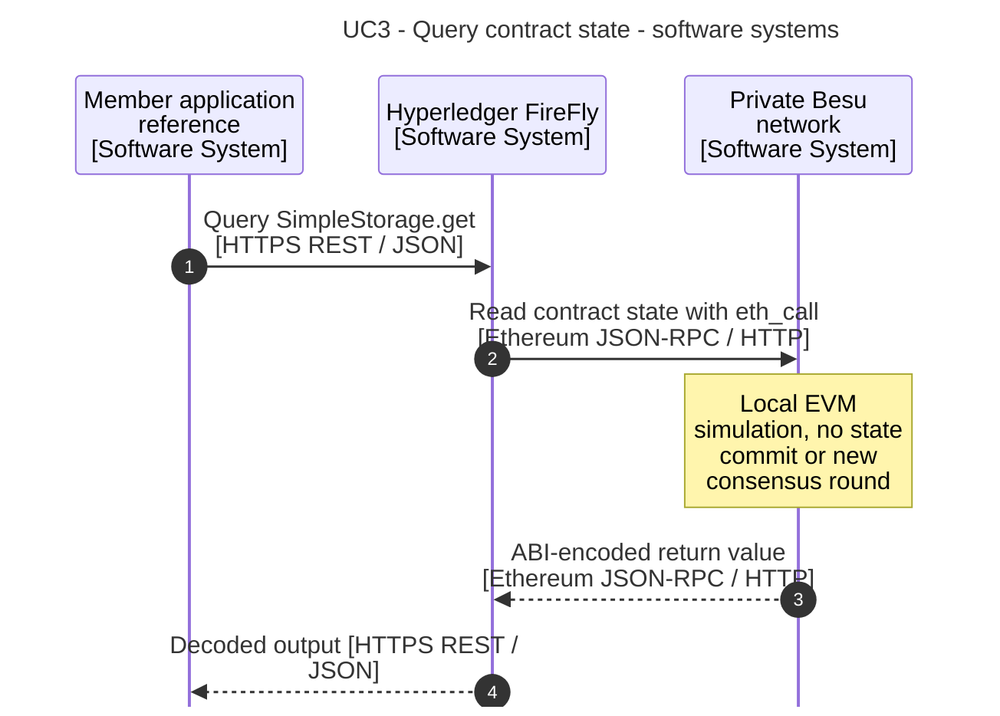
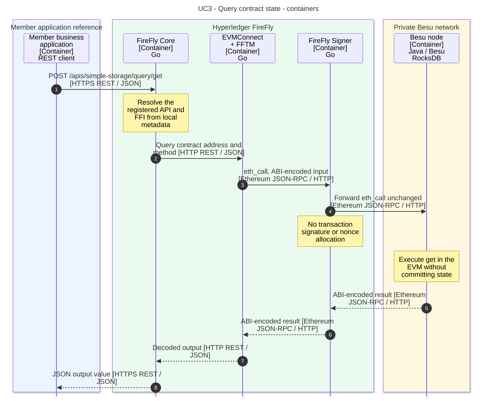

# 3. Query contract state

[Use-case index and shared notation](README.md)

Read the integer held by `SimpleStorage` through its generated API.

**Prerequisites:** The deployed contract has the registered `simple-storage` API from use case 2. The configured Besu RPC endpoint is reachable.

**Outcome:** The caller receives the decoded current value, for example `{"output":"3"}`.

## API and example

`POST /apis/simple-storage/query/get` with `{}` executes the contract's view method. HTTP POST is the FireFly query interface; it does not imply an Ethereum transaction.

All API paths in this document use the namespace prefix `/api/v1/namespaces/{ns}` unless stated otherwise. The diagrams abbreviate that prefix. Names and addresses are example values.

## Software-system sequence

## Container sequence

## Behavior and failure cases

- The configured RPC route passes through FireFly Signer even for reads. Signer proxies `eth_call`; it does not sign it.
- A query does not create a managed blockchain transaction, charge transaction gas, or commit contract changes. EVM execution still has resource limits.
- RPC unavailability, a mismatched ABI/address, or a reverted simulation returns an error rather than a valid result.
- The value reflects the state available to the queried node. Wait for the preceding write's successful execution before assuming a query will reflect it. Core metadata storage is omitted from the diagram because this flow focuses on ledger reads.

## Official sources

- [Ethereum smart-contract tutorial](https://github.com/hyperledger-firefly/firefly/blob/9d20f3081c9074d5b012427e5572ebc03da8d95d/doc-site/docs/tutorials/custom_contracts/ethereum.md).
- [FireFly Signer: passthrough JSON-RPC](https://github.com/hyperledger-firefly/signer/blob/cfafd71fb4d2c3061a946f6466269877c3f04d9d/README.md).

The [evidence baseline and model mapping](README.md#evidence-baseline) distinguish documented behavior from this workspace's configuration choices.
