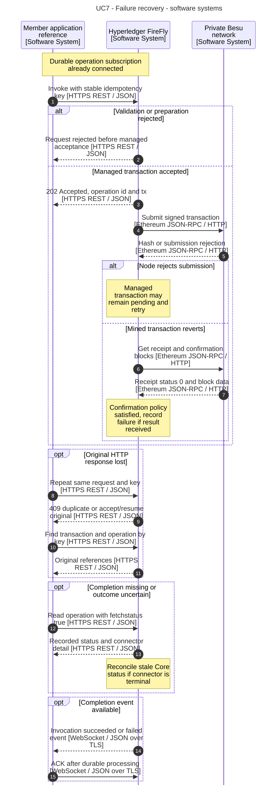
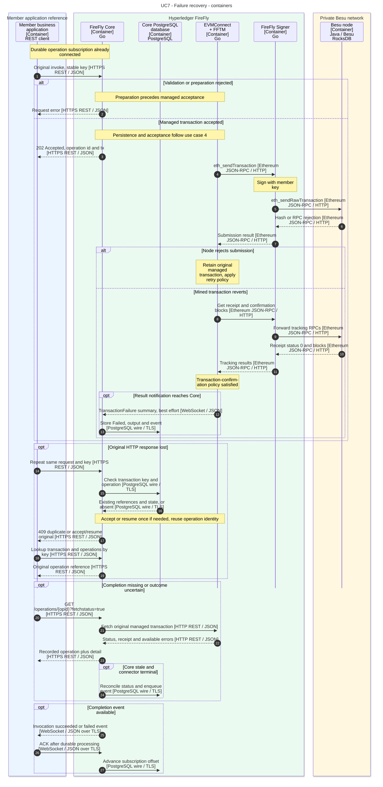

# 7. Handle failures and uncertain submissions

[Use-case index and shared notation](README.md)

Determine whether a contract action was rejected, reverted, remains pending, or was accepted despite a lost HTTP response or connector notification, without accidentally creating another business action.

**Prerequisites:** The application assigns and retains a stable `idempotencyKey` for each intended action before invoking it. Core and connector persistence are available for reconciliation. The [durable operation subscription](README.md#asynchronous-application-pattern) is established before submission.

**Outcome:** The application recovers the original transaction/operation and its outcome, or reports a definite failure. Any administrative resubmission is an explicit separate decision.

## API and example

Use the same invocation endpoint and request body as use case 4. For recovery:

- `GET /transactions?idempotencykey=<URL-encoded-key>` finds the original FireFly transaction. The **query filter is lowercase** `idempotencykey`; the **request body field is camelCase** `idempotencyKey`.
- `GET /transactions/{txnid}/operations` obtains its operations.
- `GET /operations/{opid}` reads the recorded result; `?fetchstatus=true` also requests live connector detail.
- `POST /operations/{opid}/retry` is an administrative resubmission, not the normal response to an HTTP timeout.

### Reconcile a missing completion

Use pushed operation events for normal completion. Reconcile an operation after an application-defined completion deadline or an outage, using backoff rather than continuous polling.

1. If the HTTP response was lost, repeat the **same request with the same idempotency key**. A `409` identifies an existing action; it does not establish success. Resolve its transaction and operations using the lookup APIs above. If an operation ID is already known, skip these lookups.
2. Fetch `GET /operations/{opid}?fetchstatus=true`. Inspect `detail.status`, `detail.receipt` and available error/history information. The top-level Core `status` can lag the connector; an unavailable connector detail is an unknown outcome, not failure.
3. If the original connector result was missed, the pinned Ethereum plugin can reconcile a pending/initialized Core operation when it observes a terminal connector result. Core updates and event creation are asynchronous; the same HTTP response need not contain the refreshed Core status. Continue consuming the durable subscription and handle a later or repeated completion idempotently.
4. If the connector is still pending, retain the original operation and allow its transaction policy to progress. Do not create a new idempotency key or administratively retry just because a completion event is late.

A connector result summary has no durable subscription/ACK, unlike the contract-event batches in use case 5. Reconnecting the application alone cannot recover a notification lost between EVMConnect and Core.

For a deployment with a lost notification, obtain the address from `detail.receipt.contractLocation.address`. The pinned reconciliation path does not copy that address into Core's `output`; the normal result path in use case 1 does.

`SimpleStorage.set` in the tutorial has no business-rule rejection. The revert branch below is a generic contract/EVM failure scenario, not an invented rule of that example.

All API paths in this document use the namespace prefix `/api/v1/namespaces/{ns}` unless stated otherwise. The diagrams abbreviate that prefix. Names and addresses are example values.

## Software-system sequence

## Container sequence

## Behavior and failure cases

- The lookup arrows summarize `GET /transactions?idempotencykey=...` followed by `GET /transactions/{txnid}/operations`. Submission persistence, preparation RPCs and routine database reads are summarized; use cases 4 and 5 provide those details. If the original request was never accepted, reusing its key can accept it once. If a stored operation is still `Initialized` after an interrupted attempt, Core can resume it with the same operation identity instead of returning a conflict. A duplicate `409` is not a successful execution result; inspect the existing transaction.
- Validation/preparation rejection occurs before managed acceptance. A persisted Core operation can still exist; inspect it to distinguish a definite rejection from an interrupted attempt that remains `Initialized`. Preparation may use read/simulation RPCs without submitting a ledger transaction.
- A node submission error is not always terminal: the simple transaction handler can retain the managed transaction and retry under policy. An absent receipt or unavailable status endpoint is not proof that the action failed.
- Connector communication retries reuse the original operation identity; transaction-manager resubmission follows its nonce and transaction policy. The FFTM database and routine persistence steps are omitted here and detailed in use case 4.
- Administrative `POST /operations/{opid}/retry` marks the old operation `Retried` and allocates a new operation ID. First establish that retry is justified; this is not equivalent to deduplicating a timed-out API request.
- A mined revert becomes a terminal connector result after its transaction-confirmation policy is satisfied. Core receives a status summary; detailed receipt/error fields are obtained with `fetchstatus=true`.
- For a mined revert, application contract state changes and emitted logs are rolled back. The transaction itself remains in the ledger, and gas/nonce effects still apply. Revert text depends on Besu/connector configuration and may be absent or undecoded.

## Official sources

- [Idempotency and administrative retries](https://github.com/hyperledger-firefly/firefly/blob/9d20f3081c9074d5b012427e5572ebc03da8d95d/doc-site/docs/reference/idempotency.md).
- [Blockchain operation errors](https://github.com/hyperledger-firefly/firefly/blob/9d20f3081c9074d5b012427e5572ebc03da8d95d/doc-site/docs/reference/blockchain_operation_errors.md).
- [Blockchain Connector Toolkit](https://github.com/hyperledger-firefly/firefly/blob/9d20f3081c9074d5b012427e5572ebc03da8d95d/doc-site/docs/architecture/blockchain_connector_framework.md).
- [Official API specification](https://github.com/hyperledger-firefly/firefly/blob/9d20f3081c9074d5b012427e5572ebc03da8d95d/doc-site/docs/swagger/swagger.yaml).
- [Core contract submission and idempotent resumption](https://github.com/hyperledger-firefly/firefly/blob/9d20f3081c9074d5b012427e5572ebc03da8d95d/internal/contracts/manager.go).
- [Operation phase and error handling](https://github.com/hyperledger-firefly/firefly/blob/9d20f3081c9074d5b012427e5572ebc03da8d95d/internal/operations/manager.go).
- [Best-effort transaction-result delivery](https://github.com/hyperledger-firefly/transaction-manager/blob/5915cbc4e0e30dea25068b770dadbcc8bdfa9321/pkg/fftm/transaction_events_handler.go#L94-L120).
- [Connector status reconciliation](https://github.com/hyperledger-firefly/firefly/blob/9d20f3081c9074d5b012427e5572ebc03da8d95d/internal/blockchain/ethereum/ethereum.go#L1194-L1244).
- [Confirmation before terminal status](https://github.com/hyperledger-firefly/transaction-manager/blob/5915cbc4e0e30dea25068b770dadbcc8bdfa9321/pkg/txhandler/simple/policyloop.go#L335-L357).

The [evidence baseline and model mapping](README.md#evidence-baseline) distinguish documented behavior from this workspace's configuration choices.
